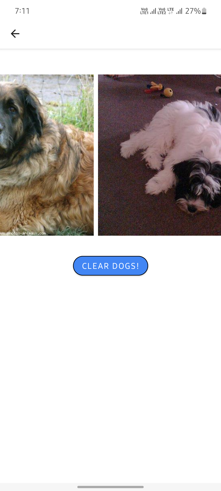

# DogImageGenerator

## APK Download 
- [Download APK](apk/app-debug.apk)
## Library Used :  
- Glide (version: 4.14.2) for Image Loading
- OkHttp (version: 4.9.0) for NetworkRequest for RandomDogGeneratorAPI

## Screenshot

- Home Screen
  - 
  - 
  - 